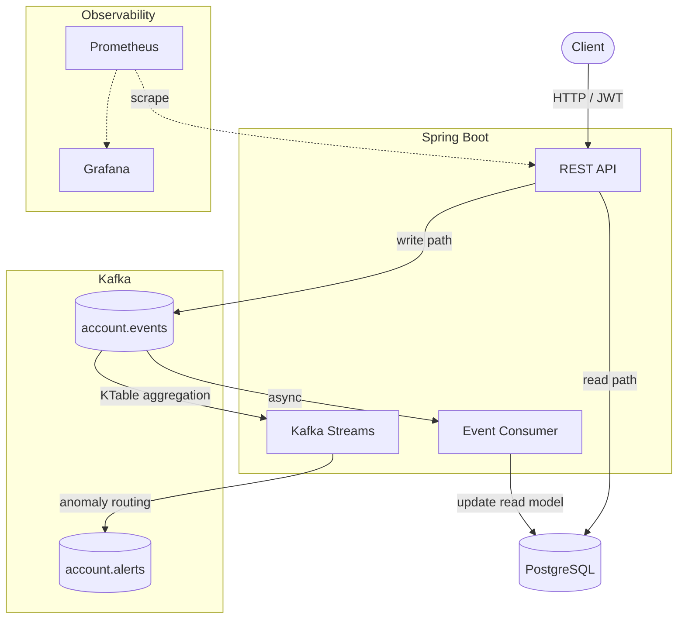

# LedgeFlow

Event-sourced financial ledger implementing CQRS with Kafka Streams. Account state is
derived entirely from an immutable Kafka event log — PostgreSQL serves as a rebuildable
read model, never the source of truth.



## Getting started

```bash
docker compose up --build
```

| Service    | URL                          |
|------------|------------------------------|
| API        | http://localhost:8080        |
| Prometheus | http://localhost:9090        |
| Grafana    | http://localhost:3000        |

Grafana credentials: `admin` / `admin`. The LedgeFlow dashboard loads automatically.

### Quick API walkthrough

```bash
# Register and get a JWT
TOKEN=$(curl -s -X POST http://localhost:8080/auth/register \
  -H "Content-Type: application/json" \
  -d '{"username":"alice","password":"secret"}' | jq -r '.token')

# Create an account
ACCOUNT=$(curl -s -X POST http://localhost:8080/accounts \
  -H "Authorization: Bearer $TOKEN" \
  -H "Content-Type: application/json" \
  -d '{"ownerId":"00000000-0000-0000-0000-000000000001","currency":"EUR"}')

ID=$(echo $ACCOUNT | grep -o '"id":"[^"]*"' | cut -d'"' -f4)

# Deposit
curl -s -X POST http://localhost:8080/accounts/$ID/deposit \
  -H "Authorization: Bearer $TOKEN" \
  -H "Content-Type: application/json" \
  -d '{"amount":100.00,"currency":"EUR"}'

# Check balance (give the event consumer a moment to process)
curl -s http://localhost:8080/accounts/$ID \
  -H "Authorization: Bearer $TOKEN"

# Rebuild the entire read model from the Kafka event log (admin only)
ADMIN_TOKEN=$(curl -s -X POST http://localhost:8080/auth/login \
  -H "Content-Type: application/json" \
  -d '{"username":"admin","password":"admin"}' | jq -r '.token')

curl -s -X POST http://localhost:8080/admin/rebuild \
  -H "Authorization: Bearer $ADMIN_TOKEN"
```

## Stack

- Java 21 · Spring Boot 4
- Apache Kafka · Kafka Streams
- PostgreSQL 16 · Flyway
- Spring Security · JWT
- Micrometer · Prometheus
- Micrometer Tracing
- Testcontainers · Docker Compose

## What's built so far

- REST API — accounts, deposit, withdrawal, transfer
- JWT authentication — register, login, role-based access; role stored as JWT claim, enforced by Spring Security
- Kafka producer — all financial operations publish typed events to `account.events`
- Event consumer — reads Kafka, updates PostgreSQL read model with idempotency
- Kafka Streams topology — KTable balance aggregation (transfer events fan-out to both accounts), threshold-based large-transaction alerts routed to `account.alerts`; the `balance-store` state store is the foundation for interactive queries on the write path if the read model is ever removed
- Admin rebuild endpoint — deletes the entire read model and replays Kafka from offset 0
- Micrometer metrics exposed at `/actuator/prometheus`
- Micrometer Tracing — 100% sampling, W3C trace context propagated through Kafka producer and consumer headers; no export backend in the dev stack
- Testcontainers integration tests — deposit, withdrawal, transfer, idempotency, and admin rebuild verified end-to-end against real Kafka and PostgreSQL
- Flyway versioned migrations — five migrations, four tables (`accounts`, `transactions`, `processed_events`, `users`)
- Docker Compose — `docker compose up --build` starts the full stack: app, Kafka, PostgreSQL, Prometheus, Grafana

## Design decisions and trade-offs

**Write-path consistency boundary**

The write path (`deposit`, `withdraw`, `transfer`) reads the current balance from the PostgreSQL read model, validates it in memory, then publishes an event to Kafka. The Kafka Streams KTable is the authoritative balance, but it is not queried on the write path.

This creates a TOCTOU race: two concurrent withdrawals can both read the same balance, both pass the sufficiency check, and both publish events — driving the account into a negative balance.

`withdraw()` and `transfer()` include a partial mitigation: they bump the `@Version` column on the account row before publishing, so two concurrent requests serialise at the database commit — the second writer receives HTTP 409 and can retry. However, the Kafka publish happens before the database transaction commits, so in the window between publish and commit a second concurrent request may also have already published its event. Full prevention requires atomic command-write and event-publication, which needs either an outbox pattern or Kafka transactions.

In production this would be fully resolved by one of:
- An outbox pattern — write the event to a DB table in the same transaction as the command, then relay to Kafka
- A dedicated command-side aggregate with balance authoritative on the write path, updated transactionally before event publication
- Querying the Kafka Streams state store via interactive queries, making the KTable the write-path authority

The current approach limits the race window and surfaces conflicts as retryable 409 responses rather than silent overwrites.

**Per-account authorization**

The API authenticates all requests and enforces role-based access (`ADMIN` for the rebuild endpoint), but does not verify that the authenticated principal owns the account being acted on. Any authenticated user can read or mutate any account by UUID. This is a deliberate scope boundary; production enforcement would derive `ownerId` from the JWT subject and add an ownership check in the service layer.

**PostgreSQL as rebuildable read model**

PostgreSQL holds no state that cannot be reconstructed by replaying Kafka from offset 0. The `POST /admin/rebuild` endpoint demonstrates this: it drops all read-model rows, then replays the full event log. Kafka is the source of truth; PostgreSQL is a queryable cache.

## Status

Dashboard screenshot pending — run `docker compose up` and capture the Grafana LedgeFlow panel.
